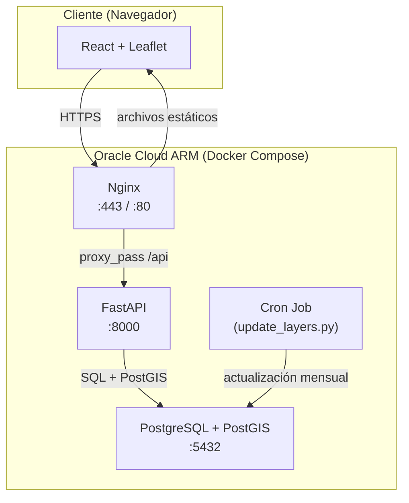
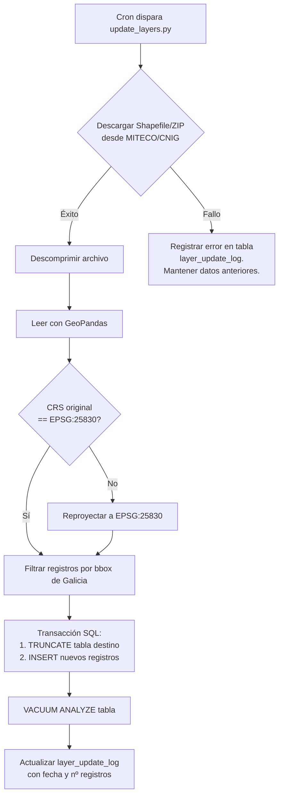
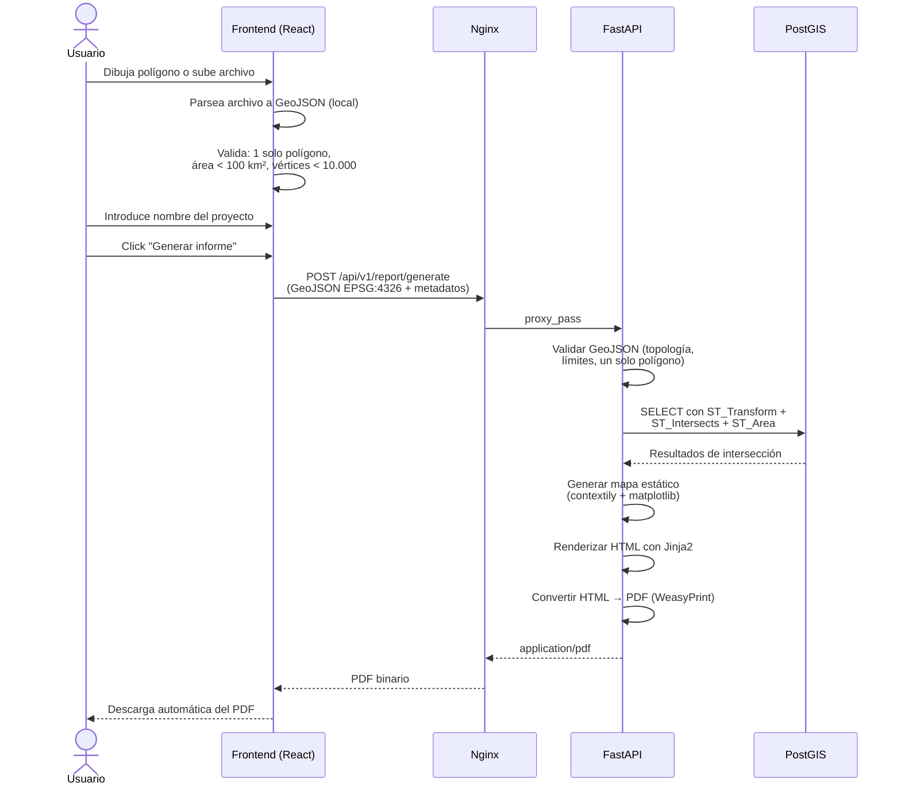

# GeoViable — Arquitectura del sistema y flujos de datos

## 1. Visión general de la arquitectura



## 2. Infraestructura y despliegue

### Servidor

| Aspecto | Detalle |
|---|---|
| Proveedor | Oracle Cloud Infrastructure (OCI) — Always Free |
| Arquitectura | ARM (Ampere A1) |
| RAM | 24 GB |
| Almacenamiento | 200 GB (block storage) |
| SO | Ubuntu 22.04 LTS (ARM64) |

### Contenedores Docker

| Contenedor | Imagen base | Puertos internos | Propósito |
|---|---|---|---|
| `geoviable-db` | `postgis/postgis:15-3.4` | 5432 | PostgreSQL + PostGIS |
| `geoviable-api` | `python:3.11-slim` (custom) | 8000 | FastAPI + WeasyPrint + cron |
| `geoviable-web` | `nginx:1.25-alpine` | 80 | Proxy inverso + archivos estáticos React |

> **Nota ARM:** Verificar que las imágenes Docker tengan soporte `linux/arm64`. `postgis/postgis` y `nginx` lo soportan nativamente. Para el contenedor API con WeasyPrint, usar la imagen base `python:3.11-slim` para ARM y compilar dependencias de WeasyPrint (Pango, Cairo) en el Dockerfile.

### Red interna Docker

```yaml
networks:
  geoviable-net:
    driver: bridge
```

- Los contenedores se comunican por nombre de servicio dentro de `geoviable-net`.
- Solo `geoviable-web` (Nginx) expone puertos al exterior (80, 443).
- `geoviable-db` y `geoviable-api` **no** exponen puertos al host.

### Volúmenes persistentes

| Volumen | Montaje | Propósito |
|---|---|---|
| `pgdata` | `/var/lib/postgresql/data` | Datos persistentes de PostgreSQL |
| `./nginx/conf.d` | `/etc/nginx/conf.d` | Configuración de Nginx |
| `./frontend/build` | `/usr/share/nginx/html` | Build de producción de React |
| `./certs` | `/etc/letsencrypt` | Certificados SSL |

## 3. Estrategia de actualización de datos

### Script `update_layers.py`

El backend incluye un script Python que mantiene las capas ambientales actualizadas.

| Aspecto | Detalle |
|---|---|
| Frecuencia | Día 1 de cada mes a las 03:00 UTC (cron job) |
| Ejecución | Dentro del contenedor `geoviable-api` |
| Método de descarga | `requests` + `BeautifulSoup` para localizar enlaces de descarga en las páginas de MITECO/CNIG |
| Fallback | Si requiere JavaScript: Playwright en modo headless |

### Flujo de actualización por capa



### Estrategia de actualización: TRUNCATE + INSERT (dentro de transacción)

- Se usa TRUNCATE + INSERT dentro de una sola transacción.
- Si falla la descarga o la carga, se hace ROLLBACK y los datos anteriores permanecen intactos.
- La tabla `layer_update_log` registra cada intento (éxito o fallo) con timestamp y detalles.

## 4. Flujo de evaluación ambiental (core del negocio)



### Detalle de la consulta SQL espacial

```sql
-- Ejemplo: cruce con la capa Red Natura 2000
SELECT
    rn.nombre,
    rn.tipo,                              -- 'ZEPA' o 'LIC/ZEC'
    rn.codigo,
    ST_Area(ST_Intersection(rn.geom, ST_Transform(ST_SetSRID(ST_GeomFromGeoJSON(:user_geojson), 4326), 25830))) AS area_interseccion_m2,
    ST_Area(ST_Transform(ST_SetSRID(ST_GeomFromGeoJSON(:user_geojson), 4326), 25830)) AS area_parcela_m2,
    ROUND(
        100.0 * ST_Area(ST_Intersection(rn.geom, ST_Transform(ST_SetSRID(ST_GeomFromGeoJSON(:user_geojson), 4326), 25830)))
        / ST_Area(ST_Transform(ST_SetSRID(ST_GeomFromGeoJSON(:user_geojson), 4326), 25830)),
        2
    ) AS porcentaje_solape
FROM red_natura_2000 rn
WHERE ST_Intersects(
    rn.geom,
    ST_Transform(ST_SetSRID(ST_GeomFromGeoJSON(:user_geojson), 4326), 25830)
);
```

### Decisión de diseño: endpoint unificado

> **ADR-001:** Se usa un **único endpoint** (`POST /api/v1/report/generate`) que realiza el análisis y genera el PDF en una sola llamada. No se separa en dos pasos (analizar → generar) porque:
> 1. El MVP es de uso interno con pocos usuarios concurrentes.
> 2. Evita duplicación de lógica y complejidad de gestión de sesiones/caché.
> 3. El endpoint `/api/v1/analyze` se mantiene como **utilidad de desarrollo** para depurar resultados sin generar PDF.

## 5. Flujo de red (producción)

```
Internet → Cloudflare (DNS + proxy) → Oracle Cloud VM :443
  → Nginx (SSL termination + reverse proxy)
    → /api/*  → geoviable-api:8000
    → /*      → archivos estáticos React (/usr/share/nginx/html)
```