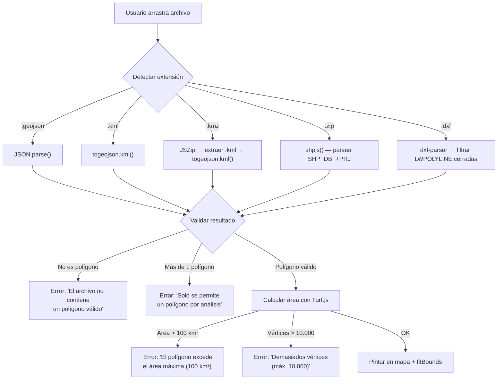

# GeoViable — Especificaciones del frontend

## 1. Stack tecnológico

| Paquete | Versión mín. | Propósito |
|---|---|---|
| `react` | 18.x | Framework UI |
| `react-dom` | 18.x | Renderizado DOM |
| `react-leaflet` | 4.x | Componentes React para Leaflet |
| `leaflet` | 1.9.x | Motor de mapas |
| `@geoman-io/leaflet-geoman-free` | última | Herramientas de dibujo/edición/eliminación de polígonos |
| `@turf/turf` | 7.x | Cálculos geoespaciales en cliente (área, validación) |
| `togeojson` | 5.x | Parseo de KML/KMZ → GeoJSON |
| `shpjs` | 4.x | Parseo de Shapefile (.zip) → GeoJSON |
| `jszip` | 3.x | Descompresión de KMZ (es un .zip con KML dentro) |
| `dxf-parser` | 1.x | Parseo de archivos DXF → objetos JS |
| `axios` o `fetch` | — | Llamadas HTTP a la API |

> **Nota sobre DXF:** El parser DXF devuelve entidades genéricas (líneas, arcos, etc.). Solo se procesarán entidades de tipo `LWPOLYLINE` y `POLYLINE` cerradas, convirtiéndolas a polígonos GeoJSON. Si el archivo no contiene polígonos válidos, se mostrará un error claro al usuario.

## 2. Estructura de la interfaz

```
┌─────────────────────────────────────────────────────────────────┐
│  Header  │  Logo GeoViable  │  Estado de capas (última act.)   │
├──────────┬──────────────────────────────────────────────────────┤
│          │                                                      │
│ Sidebar  │              Visor cartográfico                      │
│ (320px)  │              (Leaflet fullscreen)                    │
│          │                                                      │
│ ┌──────┐ │    Centrado por defecto en Galicia                   │
│ │Dibujo│ │    Lat: 42.8, Lon: -8.0, Zoom: 8                    │
│ │      │ │                                                      │
│ │Subida│ │    Capas base:                                       │
│ │      │ │    • OpenStreetMap (por defecto)                      │
│ │Datos │ │    • PNOA-IGN satélite                               │
│ │      │ │                                                      │
│ │Generar││                                                      │
│ └──────┘ │                                                      │
│          │                                                      │
├──────────┴──────────────────────────────────────────────────────┤
│  Footer (opcional): versión, enlace a documentación             │
└─────────────────────────────────────────────────────────────────┘
```

## 3. Componentes principales

### 3.1. Visor cartográfico (`<MapViewer />`)

| Propiedad | Valor |
|---|---|
| Centro inicial | `[42.8, -8.0]` (Galicia) |
| Zoom inicial | 8 |
| Zoom mínimo | 6 |
| Zoom máximo | 18 |
| Capa base por defecto | OpenStreetMap (`https://{s}.tile.openstreetmap.org/{z}/{x}/{y}.png`) |
| Capa alternativa (conmutable) | PNOA-IGN (WMS: `https://www.ign.es/wms-inspire/pnoa-ma`, layer `OI.OrthoimageCoverage`) |
| Controles visibles | Zoom (Leaflet), toolbar Geoman, botones flotantes (`Dibujar`, `Satélite ON/OFF`) |

**Comportamiento:**
- Al cargar/dibujar un polígono, el mapa ajusta automáticamente el zoom (`fitBounds`) al polígono.
- El polígono del usuario se dibuja con borde `#334155` y relleno semitransparente (`opacity: 0.15`).
- La capa PNOA se activa/desactiva con botón `Satélite ON/OFF` (en mapa y en sidebar).
- Las afecciones del análisis **sí** se pintan en el mapa tras pulsar `Cargar capas en el polígono`, usando `intersection_geometry` devuelta por la API.
- Las geometrías de afección muestran tooltip con nombre de capa y etiqueta de entidad cuando existe.

### 3.2. Panel de herramientas — Sidebar (`<ToolPanel />`)

#### Sección de dibujo (`<DrawTools />` + Geoman)

- Botón `Dibujar polígono`: activa/cancela el modo dibujo.
- Edición y borrado disponibles desde la toolbar de Geoman (iconos sobre el mapa).
- **Restricción:** solo se permite un polígono a la vez. Si ya existe uno, al intentar dibujar otro se muestra un error y se exige borrarlo primero.

#### Sección de mapa base (`Mapa base`)

- Botón de alternancia para activar/desactivar `PNOA satélite` desde la sidebar.
- Este control replica la acción del botón flotante `Satélite ON/OFF` del mapa.

#### Sección de subida de archivos (`<FileUploader />`)

- Zona de drag & drop con texto: _"Arrastra un archivo aquí o haz clic para seleccionar"_.
- Formatos aceptados: `.geojson`, `.kml`, `.kmz`, `.zip` (Shapefile), `.dxf`.
- Tamaño máximo: **5 MB**.
- Indicador visual del formato detectado tras la subida.

**Flujo de parseo local:**



#### Sección de datos del proyecto (`<ProjectForm />`)

| Campo | Tipo | Requerido | Validación |
|---|---|---|---|
| Nombre del proyecto | `text` | ✅ | 3-100 caracteres |
| Autor / responsable | `text` | ❌ | 0-100 caracteres |
| Descripción breve | `textarea` | ❌ | 0-500 caracteres |

#### Sección de generación (`<GenerateReport />`)

- **Botón previo:** `Cargar capas en el polígono` (ejecuta `POST /api/v1/analyze` y pinta afecciones en el mapa).
- **Botón principal:** "Generar informe de viabilidad (PDF)" — estilo CTA prominente.
- **Deshabilitado** si no hay polígono cargado o si falta el nombre del proyecto.
- Al generar informe, se envía en `project.basemap` la preferencia de mapa base (`PNOA` u `OpenStreetMap`) para el mapa estático del PDF.
- **Estados del botón:**

| Estado | Visual |
|---|---|
| Inactivo (sin datos) | Gris, deshabilitado, tooltip explicando qué falta |
| Listo | Color primario (azul/verde), habilitado |
| Procesando | Spinner + texto "Generando informe..." + barra de progreso indeterminada |
| Éxito | Modal con confirmación + descarga automática del PDF |
| Error | Notificación toast rojo con mensaje descriptivo |

### 3.3. Indicador de estado de capas (`<LayerStatus />`)

- En el header, muestra la fecha de última actualización de los datos ambientales.
- Llama a `GET /api/v1/layers/status` al cargar la aplicación.
- Ejemplo: _"Datos actualizados al: 01/04/2026"_.
- Si la última actualización tiene más de 45 días, mostrar advertencia amarilla.

## 4. Gestión de errores en el frontend

| Escenario | Mensaje al usuario | Acción |
|---|---|---|
| Archivo no reconocido | "Formato de archivo no soportado. Usa GeoJSON, KML, KMZ, SHP (.zip) o DXF." | Toast de error |
| Archivo sin polígonos | "El archivo no contiene un polígono válido." | Toast de error |
| Más de 1 polígono | "Solo se permite un polígono por análisis. El archivo contiene N polígonos." | Toast de error |
| Archivo > 5 MB | "El archivo es demasiado grande. Máximo 5 MB." | Toast de error |
| Área > 100 km² | "El polígono excede el área máxima permitida (100 km²)." | Toast de error |
| Vértices > 10.000 | "El polígono tiene demasiados vértices (máximo 10.000)." | Toast de error |
| Error de red | "No se pudo conectar con el servidor. Inténtalo de nuevo." | Toast de error + botón reintentar |
| Timeout del backend | "La generación del informe ha excedido el tiempo máximo. Reduce el área del polígono." | Toast de error |
| Error 500 del backend | "Error interno del servidor. Contacta al administrador." | Toast de error |

## 5. Responsive design

| Breakpoint | Comportamiento |
|---|---|
| ≥ 1024px (desktop) | Layout con sidebar lateral (320px) + mapa |
| 768px–1023px (tablet) | Sidebar como panel colapsable superpuesto al mapa |
| < 768px (móvil) | Sidebar como bottom sheet deslizable; mapa ocupa toda la pantalla |

## 6. Rendimiento

- Lazy loading de las librerías de parseo (shpjs, dxf-parser) — solo se cargan cuando el usuario sube un archivo del tipo correspondiente.
- El build de React se sirve pre-comprimido (gzip) desde Nginx.
- No hay polling ni WebSockets en el MVP — la comunicación es request/response simple.

## 7. Nota de despliegue frontend

- En ejecución con Docker/Nginx (`geoviable-web`), la UI se sirve desde `frontend/build`.
- Los cambios en `frontend/src` no se reflejan hasta ejecutar `npm run build`.
- Si tras recompilar no se actualiza el navegador, reiniciar `geoviable-web`.